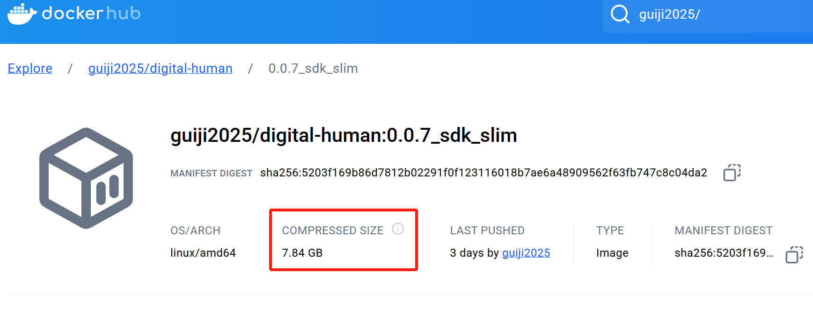
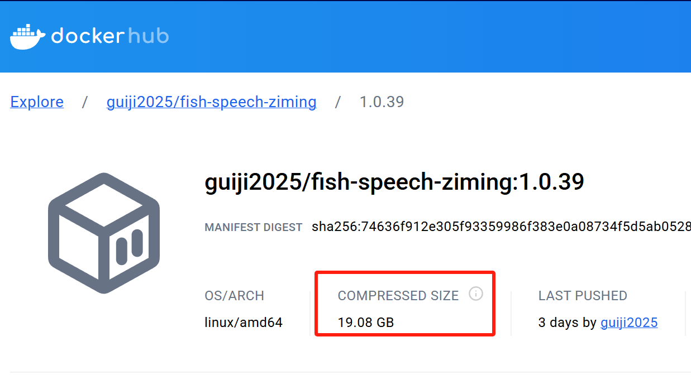
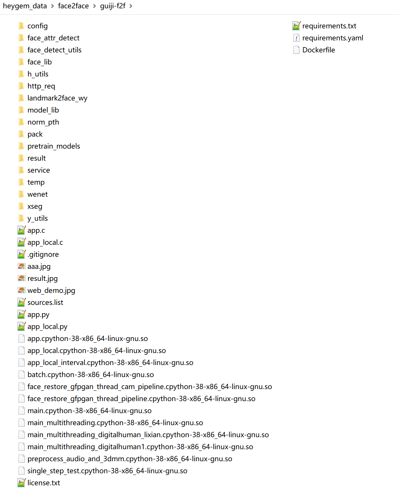
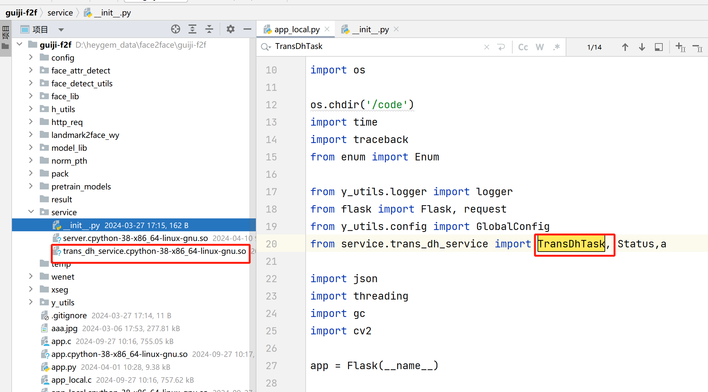

# 硅基数字人HeyGem.ai
> 分析硅基最新开源的数字人项目HeyGem
> 
> https://github.com/GuijiAI/HeyGem.ai

## 一. 先说结论
我的结论：没有核心源码，有模型，效果还行，断网能用。

## 二. 概览
1. 客户端：开源了源码，github全是前端vue.js代码，用electron-vite打包成一个pc本地软件运行。
2. 服务端： 提供三个docker镜像
   - face2face： 硅基的sdk，数字人对口型
   
   - asr：fun-asr：语音识别
   
   - tts：fish-speech：语音克隆+tts合成
   

3. 一句话总结硅基的开源：
   - 结合了开源的一个tts和开源一个的语音识别，同时提供封装了硅基数字人的sdk一起作为服务，为前端界面提供接口。

## 三. 部署
1. 需求
   - 需要超100G硬盘空间 
   - 需要大内存 
   - 需要显卡
2. 关键点
   - client和server必须部署到同一台电脑：他的前端打包成立pc软件，和服务要共同操作一个本地目录来协同工作。
   - docker要支持gpu
   - 内存不能太小，不然asr启动不了
   - 磁盘不能太小，不然docker镜像下载不了

## 四. 代码分析

1. 核心的代码都没有源码： 如service.trans_dh_service
1. 加密反思：用cpython把python编译成c和so文件
1. 模型:
   - wenet+dinet+人脸检测对齐解析修复：模型先从wenet得到关键点，再decoder成face
   - pth没有加密
   - 硅基还是喜欢wenet提取音频特征
   
## 五. 扩展
- 云服务部署API：加一个文件上传下载就行，目前他是操作本地目录。
- 可以把硅基的代码弄到docker外面运行，估计只要1G空间，linux环境。
- 他核心数字人对口型模型300多MB
- 感觉很快会被技术大佬们实现简化部署和前后端文件共享分离
